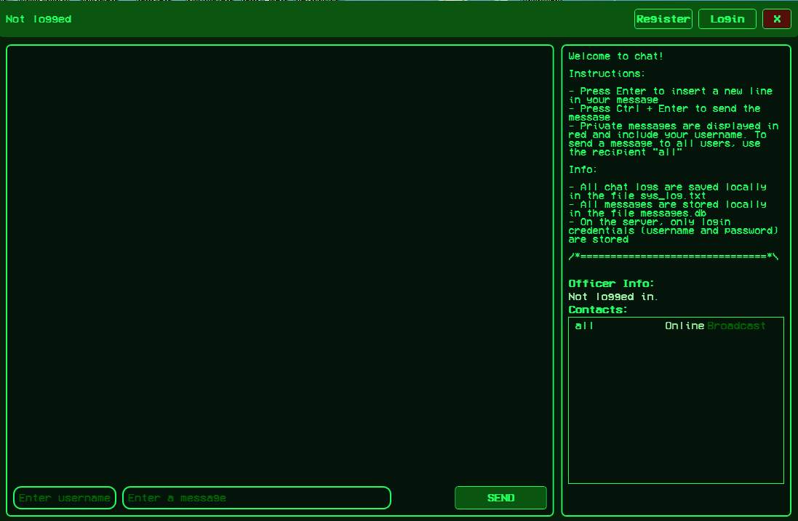

<div align="center">
  
  <h1><code>EchoLine</code></h1>
  
  **Welcome to chat!**
</div>

<div align="center">
  
</div>

**download -** [EchoLine](https://github.com/dhaubum/EchoLine/releases/tag/EchoLine_b1.0.0)

**Instructions:**
```
- Press Enter to insert a new line in your message
- Press Ctrl + Enter to send the message
- Private messages are displayed in red and include your username. To send a message to all users, use the recipient "all"
```
**Info:**
```
- All chat logs are saved locally in the file sys_log.txt
- All messages are stored locally in the file messages.db
- On the server, only login credentials (username and password) are stored
```
**Requirement**

*To run this chat application, you need to have **.NET 7.0 Desktop Runtime (v7.0.20)** installed on your system.*

*You can download it from the official Microsoft .NET [website](https://dotnet.microsoft.com/en-us/download/dotnet/7.0)*

**How to start using:**
```
- unzip the archive
- install it if it is not installed .NET 7.0 Desktop Runtime (v7.0.20)
- run ChatClient.exe
- register
- login to your account
```

Telegram: Contact [@EchoLineChat](https://t.me/EchoLineChat)
